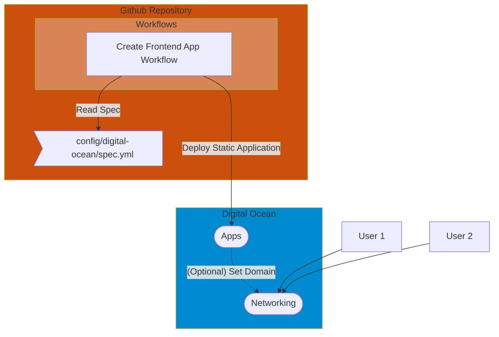
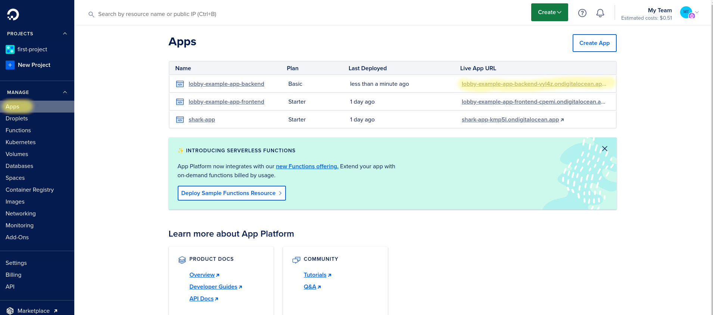
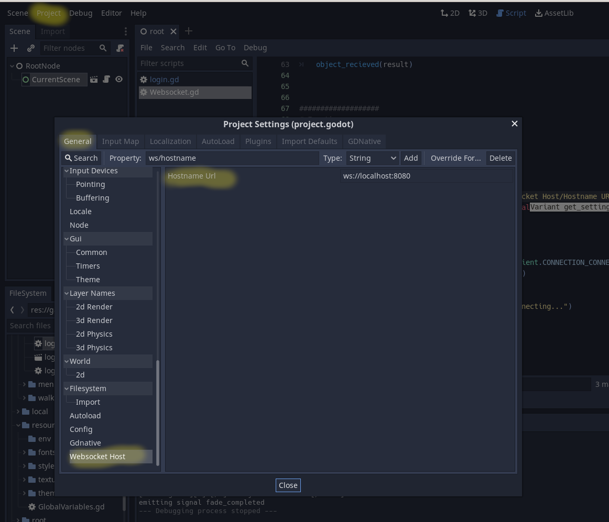
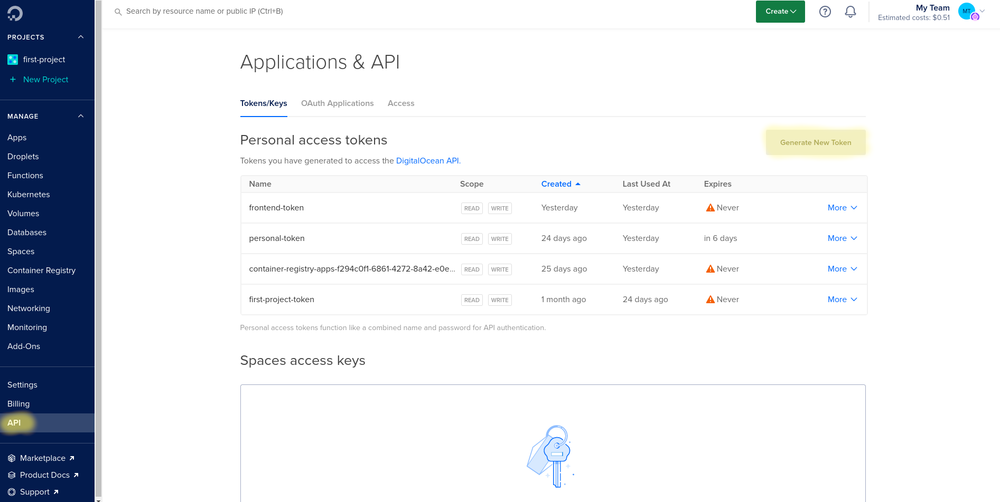
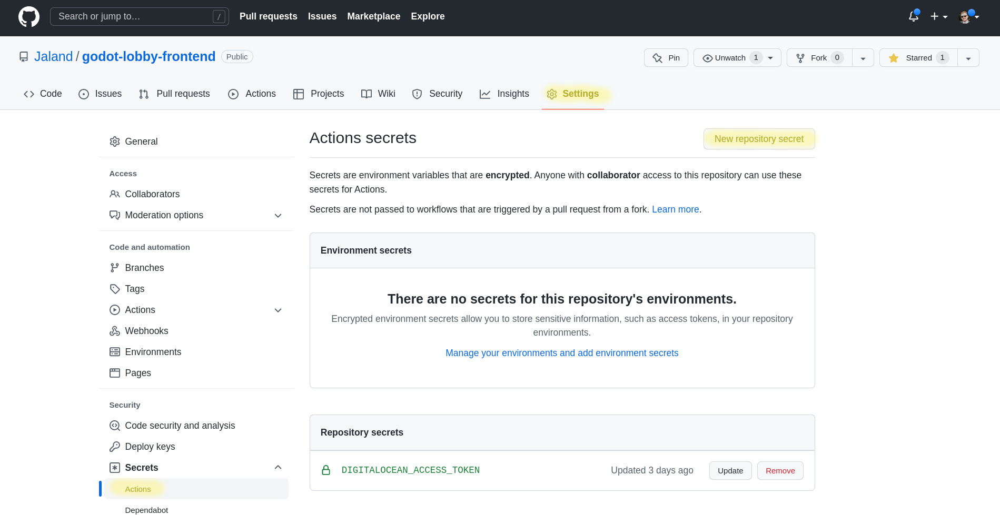
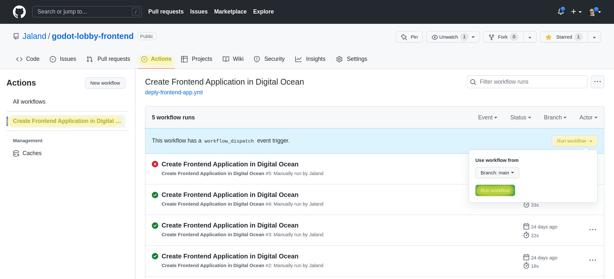
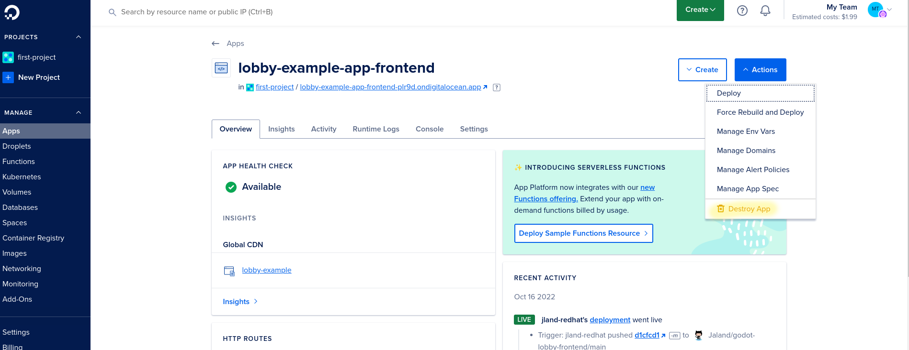

# Godot Lobby Example

The goal of this project is the creation of a basic lobby system with a frontend using Godot and a backend server built in Java using the Quarkus framework. For documentation on the the backend server check [this](https://github.com/Jaland/godot-lobby-backend) repository.

**Language:** GDScript

**Renderer:** GLES 2

## Prerequisites

* [Godot 3.4+](https://docs.godotengine.org/en/stable/)

# Deploying

## Deploying Local (Quick Deploy)

The easiest way to do local deployment of the frontend is using the Godot UI. The normal play button will create a running instance of your application that should work fine but you can also use the `Exported HTML` button to run the game in the browser. For the most part it should work the same in both, but there are some [limitations](https://docs.godotengine.org/en/stable/tutorials/export/exporting_for_web.html) between using HTML5 and the normal build. Also using the `HTML` button you can have multiple instances of the app running in different windows which makes it easier to test the lobby systems.

I have also provided a `make` files that allow for local deployment to an http server if desired using `make build-and-load`.

> Note: The make command assumes you are running on a linux machine with `httpd` and `make` installed. But again using the Godot UI for testing is actually easier IMO.

> Note: The backend server will need to be running and the [host information may need to be modified](#updating-server-host-information)

## Install on DigitalOcean

While building locally is fun and easy(er), the idea of a lobby service generally makes more sense when accessible over the internet. We can do that using the HTML5 builder to create a static site, and push it onto a server with external connections. There are many inexpensive options for this nowadays. You should be able to deploy using Google Cloud or AWS (which I think has a free teir. Or even deploy locally if you are able to open up some ports on your router (I would not recommend this for security and difficulty reasons unless you really know what you are doing). I have decided to do my deployment using [Digital Ocean's Cloud](https://cloud.digitalocean.com/), just cause I found the UI to be pretty easy to understand and the pricing was pretty straight forward (although not totally free). And the rest of this section will walk through how to do the deployment using `Digital Ocean Cloud` and `Github`.

> Note that the frontend install does not actually cost anything to host since it is a static site (but the backend will cost a little bit).

### Prerequisites

In order to use the processes I have created you will need the following:

* Forked Repository containing the code in this Repository that lives on `GitHub`
* [Digital Ocean's Cloud](https://cloud.digitalocean.com/) account
* Backend Installed, instructions can be found [here](https://github.com/Jaland/godot-lobby-backend)
  * Note: You can install the frontend without the backend and the login page will show up, but you obviously won't be able to actually log in

### Code Build/Deployment Architectures



### Updating Server Host Information

Before we install our frontend application we will need to update our configuration so that our websockets can connect to our backend. First we will need to retrieve the hostname of our backend server from `Digital Ocean`. This can be done from the home page of the `App` menu item as seen below.



Now we just need to update our project to point to our backend host!

This project includes the custom value `Websocket Host-> Hostname Url` which is set to `ws://localhost:8080` by default (so it should work if the server is installed locally). We need to update it so that we are connecting to our new host using the Websocket Secure protocol so our new url should looks like `wss://<BACKEND_HOSTNAME>`



> **Tip** Changing the value in the `resources/overrides/override.cfg` file at the base of the project will override this value when we deploy to our server using the `make build` command. Or you can copy the `override.cfg` file to the base directory if you are building directly using `godot`

### Building Your Application

Now that our hostname is set we can build our static site and push it to our Git Repo. This can be done in one of two ways:

1. **Using Make:** `make build` (Make sure to modify the the `resources/overrides/override.cfg` or use the `make build-local` command to use the value set in the godot ui)
1. **Using Godot Native:** `godot --export "HTML5"`
    * Note: Make sure that you move the `override.cfg` file to the base folder if required

> **Info:** Normally I would have the build done using `Gitlab Workflows` but doing it locally and pushing sidesteps versioning issues and just makes it simpler. Although does mean you will have to make sure you remember actually build your application before you push to the repo. Else you will end up deploying an older version of your app and being confused.

### Setting Up The  Github Repo

This project takes advantage of [Github Workflows](https://docs.github.com/en/actions/using-workflows) in order to do the installation of the frontend application to your `Digital Ocean` account, using DO's [doctl](https://docs.digitalocean.com/reference/doctl/) cli.

In order to allow Github to connect to your `Digital Ocean` account you will need to do two things:

#### Creating API Token

First create a token using the Digital Ocean UI. This can be done by navigating to `API` -> `Generate new Token`



> Tip: Make sure to capture your token on creation, there is no way to retrieve it afterwards. (But you can always just delete and recreate)

#### Creating Repository Secret

Then we need to store that token inside of a `Repository Secret` in our Git Repository that will allow our workflow to push into our DigitalOcean account.

Creating a `Repository Secret` in Github is fairly simple. Just navigate to `Settings` -> `Secrets` -> `Actions` -> `New Repository Secret`



##### Required Secrets

| Name                      | Value                                                                                                       | Example                     |
| ------------------------- | ----------------------------------------------------------------------------------------------------------- | --------------------------- |
| DIGITALOCEAN_ACCESS_TOKEN | Token retrieved from the DO cloud ui. `API -> Generate New Token`                                           |                             |

## Running Our Workflow

### Update `spec.yml`

First we need to update our [config/digital-ocean/spec.yml](config/digital-ocean/spec.yml). The only change that should be required is modifying `repo` to point to your repository instead of mine.

### Run the Workflow

The workflow is set in a way that it needs to be run manually. And should create a Digital Ocean app named `lobby-example-app-frontend` (meaning that app can not already exist, see cleanup below if it does).

To run the workflow navigate to the GitHub UI and hit `Actions` -> `Create Frontend Appllic.. Workflow` -> `Run Workflow` -> `Run Workflow` 



> Important: The workflow creates a Digital Ocean App that should be free (assuming no changes to the spec.yml besides the repo url).

## Clean Up

Currently the workflow requires the application is deleted in order to rerun, fortunately that ia pretty simple to do through the Digital Ocean UI. Just navigate to the App and hit `Actions` -> `Destroy App`



# Coding Info

Below is some information on how I organized the code. More of the high level info on overall architecture and how some of the interactions between the frontend and backend work can be found [here](https://github.com/Jaland/godot-lobby-backend#coding-info)

## File Structure

```tree
📦test-project-1
 ┣ 📂config ➊
 ┃ ┣ 📂digital-ocean
 ┃ ┃ ┗ 📜spec.yml
 ┣ 📂game ❷
 ┃ ┣ 📂chat Ⓐ
 ┃ ┣ 📂lobby Ⓑ
 ┃ ┃ ┣ 📂game_lobby ⓵
 ┃ ┣ 📂login Ⓒ
 ┃ ┣ 📂menus Ⓓ
 ┃ ┃ ┣ 📂error_menu
 ┃ ┃ ┣ 📂game_complete_menu
 ┃ ┃ ┣ 📂game_menu
 ┃ ┃ ┣ 📂start_game_menu
 ┃ ┗ 📂walking_simulator Ⓔ
 ┣ 📂resources ❸
 ┃ ┣ 📂overrides
 ┃ ┃ ┗ 📜override.cfg
 ┃ ┗ 📜GlobalVariables.gd Ⓐ
 ┣ 📂root
 ┃ ┗ 📂load-screen
 ┣ 📂target ❹
 ┣ 📂utlis ❺
 ┃ ┣ 📂custom_nodes
 ┃ ┃ ┗ 📜Websocket.gd Ⓐ
 ┣ 📜Makefile
 ┣ 📜project.godot
```

1. **config:** Contains the `spec.yaml` used for deployment of the application to Digital Ocean
1. **game:** Contains all the scenes used in the game including the login and lobby scenes
    * A. **chat:** Scene backing the player chat, note it is inherited by the lobby and game scenes
    * B. **lobby** Main Lobby Scene listing the games
      1. **game_lobby** Game Lobby, is a sub-scenes of the main lobby
    * C. **login** Login Scene
    * D. **menus** A set of different sub-scenes used for different menus in the game
    * E. **walking_simulator** Scene that is our example "game"
1. **resources:** Contains most of our assets such as sprites, textures, etc...
    * A. **GlobalVariables:** A set of values that hare shared by all of the scenes.
1. **target** Our built application, make sure to rebuild and push before trying to deploy the application
1. **utils** Set of common functions that can be used by all the scenes
    * A. **Websocket:** A custom Node that contains our Websocket logic and is inherited by nodes in our other scenes

## Scene File Structure

```tree
┣ 📂chat
┃ ┣ 📜chat.gd
┃ ┣ 📜chat.tscn
┃ ┗ 📜chat_ui.gd
```

Each scene's logic generally run through 3 main files:

1. The .tscn file (i.e. Text Scene) describing the scene
2. The <SCENE_NAME>.gd which extends the `Websocket` node and is used for the "Business Logic" and the communication with the server
3. the <SCENE_NAME>-ui.gd is used to control

## Debug Notes

When doing local debugging when not using HTML 5 build the following commands can be used to keep an eye on game and user info saved locally (assuming linux is being used)

`watch "cat ~/.local/share/godot/app_userdata/Hidden\ Movement\ Game/user.info"`
`watch "cat ~/.local/share/godot/app_userdata/Hidden\ Movement\ Game/game.info"`

When using HTML 5 the information is stored as cookies and can be seen using the inspector.
