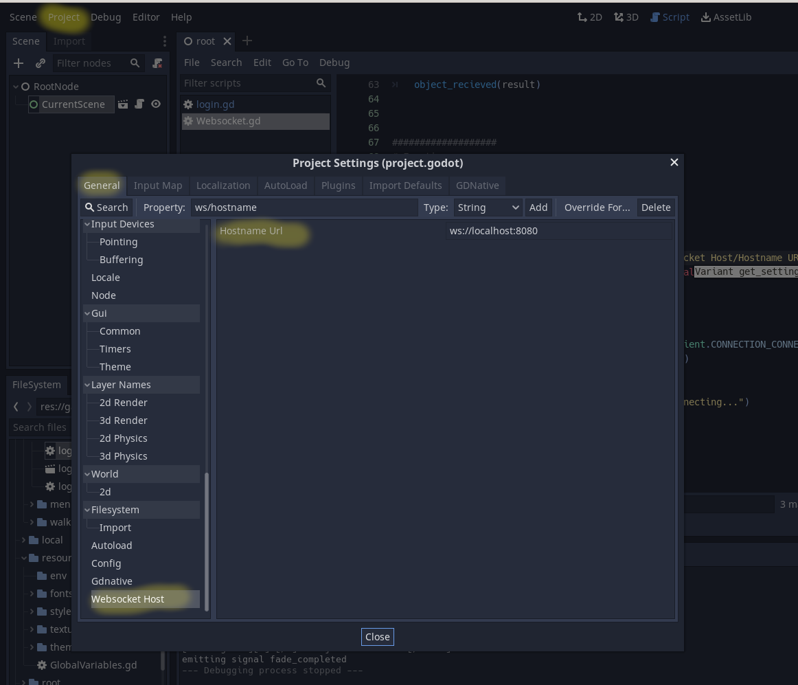

# Godot Lobby Example

The goal of this project is the creation of a basic lobby system in Godot that uses a backend server built in Java using the Quarkus framework. For documentation on the the backend server check [this](https://github.com/Jaland/godot-lobby-backend) repository.

Language: GDScript

Renderer: GLES 2

Local Dev Using: Fedora Workstation 35

# Prerequisites

[Godot](https://docs.godotengine.org/en/stable/)

The below build assumes you are on a linux machine with [HTTPD](https://httpd.apache.org/docs/2.4/install.html) installed

## Deploy locally

While I recommend most dev work being done through the Godot UI, I have provided a make files that allow for local deployment to an http server. Note, this assumes you are running on a linux machine (I am using Fedora) with http server installed.

### Building with the Make File

`make build` Creates the javascript program inside of the `target` directory

`make load-site` Will copy over the files into `/var/www/html` which should be available on `localhost` by default (assuming you are using Fedora linux)

## Install on DigitalOcean

The primary use case of this application is to create a lobby that can be deployed using the HTML5 builder, and in order to do this in away that is easily reachable it will have to be deployed onto a server. There are many inexpensive options for this nowadays such a Google Cloud, AWS free, or even locally if you are able to open up some ports (I would not recommend this for security and difficulty reasons unless you really know what you are doing).

I have recently been playing around with DigitalOcean and found that to be fairly simplistic and reasonably priced. And for the Frontend of the application we can actually deploy an application for free since it is a static site (note the backend will require a fairly small investment but I talk more about that on the [backend's readme](https://github.com/Jaland/godot-lobby-backend/blob/main/README.md))

## Updating Server Host Information

This project includes the custom value `Websocket Host-> Hostname Url` which is set to `localhost:8080` by default, but can be changed in the project settings as seen below:

> **Tip** We will use the `override.cfg`s in the `resource/env` folders to override this value when we deploy to our server using the Gitlab CI/CD

## Notes to myself

I can use the following command to keep an eye on my cached value when not using HTML 5:

`watch "cat ~/.local/share/godot/app_userdata/Hidden\ Movement\ Game/user.info"`
`watch "cat ~/.local/share/godot/app_userdata/Hidden\ Movement\ Game/game.info"`
